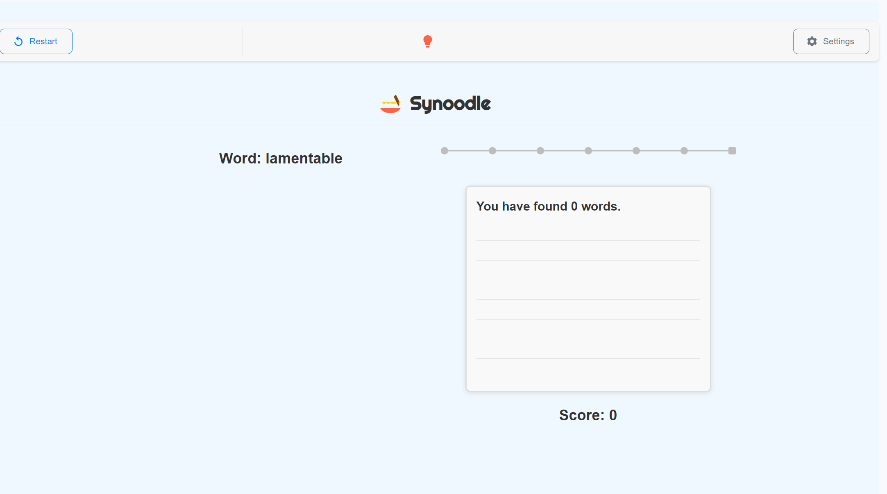

# Synonym Guessing Game

This project is a synonym guessing game built with React. Users attempt to guess synonyms of a given word, and receive feedback based on their guesses, including sound effects and visual celebrations for correct answers.

## Features

- **Word and Synonym Data**: The game fetches word and synonym data in real time from Supabase.
- **Dynamic UI**: The interface is built using Material UI (MUI) for responsive layout and a polished user experience.
- **Interactive Feedback**: The game includes sound effects for correct and incorrect guesses using `use-sound` and confetti animation for winning rounds, enhancing engagement.
- **Game Progress and Score Tracking**: Displays progress using dots, a scoreboard, and dynamically updates based on user input.
- **Hint and Restart Functionality**: Users can reveal a hint for a synonym or restart the game at any time.
- **Smooth Transitions**: Animations for showing and hiding game components using `react-transition-group`.

## Technologies Used

- **React**: For building the interactive user interface.
- **Supabase**: A backend-as-a-service used for managing the word and synonym data.
- **Material UI (MUI)**: For creating a responsive and visually appealing layout.
- **React Transition Group**: To create smooth component transitions and animations.
- **use-sound**: For adding interactive sound effects.
- **Canvas-Confetti**: For celebratory animations on successful rounds.
- **CSS Modules**: Custom styles for specific components like feedback messages and input fields.

## Components Overview

- **WordDisplay**: Displays the word that the user has to guess synonyms for.
- **InputSynonym**: Handles user input for guessing synonyms.
- **ScoreBoard**: Displays the user's current score.
- **ProgressDots**: Visualizes the user's progress in guessing synonyms.
- **FeedbackMessage**: Shows feedback on the user's guesses (correct, incorrect, or already guessed).
- **GuessesDisplay**: Shows the synonyms guessed so far and their corresponding letters.
- **GameFinish**: Displays the end game screen with options to play again.
- **Toolbar**: Provides controls for restarting the game, revealing hints, and accessing settings.
- **GameTitle**: Displays the title of the game.

## How to Run the Project

1. Clone the repository.
2. Install the dependencies using `npm install`.
3. Set up Supabase credentials in `supabaseClient.js`.
4. Run the project using `npm start`.

## Future Improvements

- Add difficulty levels to vary the word complexity.
- Implement user accounts to save high scores and track progress.
- Add a leaderboard to encourage competition among users.

## Screenshots

## License

This project is open-source and available under the MIT License.
